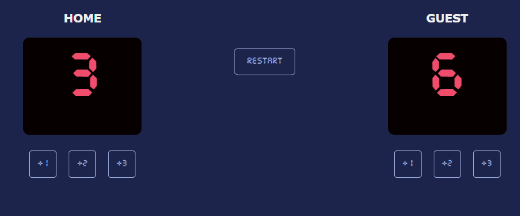

# Basketball scoreboard
This is a Basketball Scoreboard.

## Table of contents

- [Overview](#overview)
  - [The challenge](#the-challenge)
  - [Screenshot](#screenshot)
  - [Links](#links)
- [My process](#my-process)
  - [Built with](#built-with)
  - [What I learned](#what-i-learned)
  - [Useful resources](#useful-resources)
- [Author](#author)
- [Acknowledgments](#acknowledgments)

## Overview

### The challenge

Users should be able to register the scores for both home and guest teams. In the long run,it should be possible to reset the score board (e.g. start a new game).

### Screenshot

### Links

- Repo URL: [Repo URL](https://github.com/mwambao/basketball-scoreboard)
- Live Site URL: Basketball scoreboard](https://basketball-scoreboard-beryl.vercel.app/)

## My process

### Built with

- Semantic HTML5 markup
- CSS custom properties
- CSS Flex
- JavaScript

### What I learned

I enhanced my skills on using CSS Flex, JS functions and onclick event listener.

### Useful resources

- [JavaScript Tutorial](https://www.w3schools.com/js/default.asp) - My place to go if i need to quickly check on something!
- [MDN for HTML, CSS and JavaScript](https://developer.mozilla.org/en-US/) - One of the primary resources.

## Author

- Website - [Duncan Owino Mwamba](https://mwambao.github.io/)
- Frontend Mentor - [@mwambao](https://www.frontendmentor.io/profile/mwambao)
- Twitter - [@mwambad](https://x.com/mwambad)

## Acknowledgments

